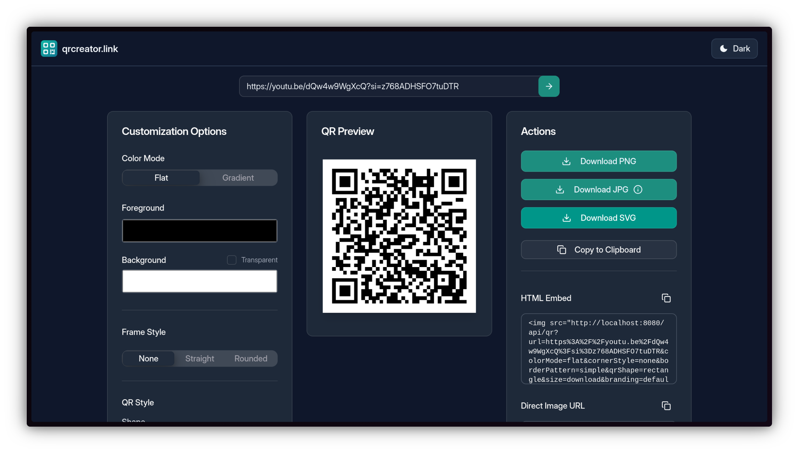
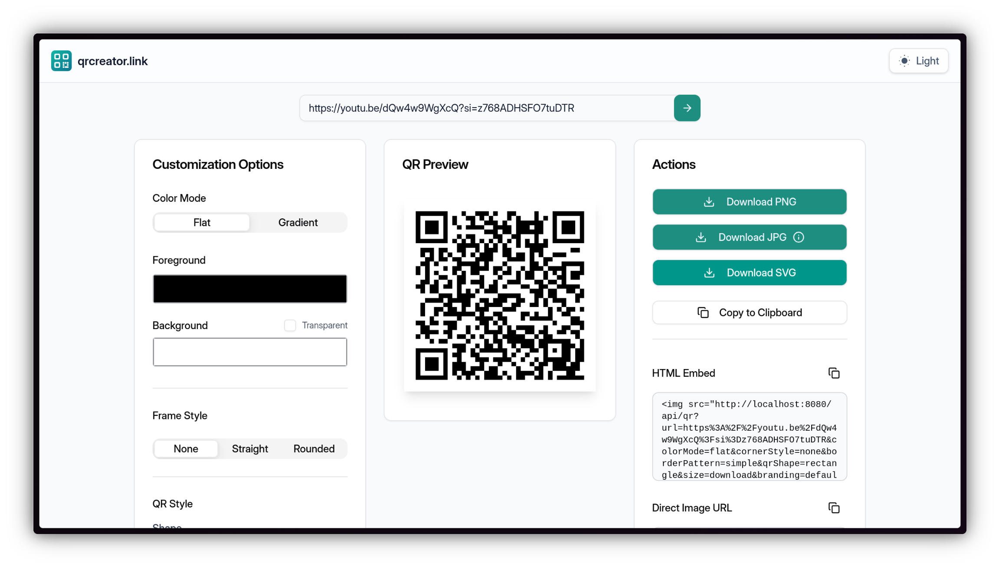

<h1> qrcreator.link</h1>


Source code of qrcreator.link site made with Go + templ, using Tailwind, HTMX, AlpineJS, templui for components.
The service is up & running in [qrcreator.link](https://qrcreator.link)

In case you didn't figure it out yet, it's a QR creator website.


## Showcase

Below are some screenshots of the QR generator UI and outputs.

<p align="center">
  <strong>Website UI</strong><br/>
  
  
</p>

<p align="center">
  <strong>Generated QR Samples</strong><br/>
  
  
  
  
  
</p>

## Quick Run

If you want to simply download and run, you can:

### 1. git clone https://github.com/cristianadrielbraun/qrcreator.link && cd qrcreator.link

### 2. go run .

That's it. It will be running and functional on port 8080.


## Dev Setup

If you want to be able to develop further, you should install the dependencies as well:

### 1. Install TailwindCSS according to your platform and preference. Personally, I just download and chmod +x the binary:

For Linux:
```
curl -sLO https://github.com/tailwindlabs/tailwindcss/releases/latest/download/tailwindcss-linux-x64
chmod +x tailwindcss-linux-x64
sudo mv tailwindcss-linux-x64 /usr/local/bin/tailwindcss
```
macOS (Apple Silicon):
```
curl -sLO https://github.com/tailwindlabs/tailwindcss/releases/latest/download/tailwindcss-macos-arm64
chmod +x tailwindcss-macos-arm64
sudo mv tailwindcss-macos-arm64 /usr/local/bin/tailwindcss
```
macOS (Intel):
```
curl -sLO https://github.com/tailwindlabs/tailwindcss/releases/latest/download/tailwindcss-macos-x64
chmod +x tailwindcss-macos-x64
sudo mv tailwindcss-macos-x64 /usr/local/bin/tailwindcss
```

Windows:
```
Download from https://github.com/tailwindlabs/tailwindcss/releases/latest/download/tailwindcss-windows-x64.exe
Add to your PATH as 'tailwindcss'
```

If you prefer any other method, just check the [Official documentation](https://tailwindcss.com/docs/installation/)


### 2. Install templ CLI:

   `go install github.com/a-h/templ/cmd/templ@latest`


### 3. Install templui library:
   `go install github.com/templui/templui/cmd/templui@latest`

Also check the official templui docs: [Introduction - templUI](https://templui.io/docs/introduction)

### 4. Install Go dependencies:
   `go mod tidy`


When making changes, you should regenerate the tailwind.min.css; regenerate the templ files; then run or compile.


## Dependencies
---------
The project relies on these main external libraries and tools:

- Go server/runtime
  - Gin: https://github.com/gin-gonic/gin — HTTP router for the `/api` endpoints
  - templ: https://github.com/a-h/templ — component-based HTML templates used in `web/.../*.templ`
  - templui: https://github.com/templui/templui — prebuilt UI components used within templ templates
  - go-qrcode: https://github.com/yeqown/go-qrcode — QR generation core
  - oksvg: https://github.com/srwiley/oksvg and rasterx: https://github.com/srwiley/rasterx — SVG parsing/rasterization utilities

- Frontend assets
  - Tailwind CSS: https://tailwindcss.com — styling (prebuilt CSS is included under `web/static/css`)
  - HTMX: https://htmx.org — lightweight interactivity for a few UI actions
  - Alpine.js: https://alpinejs.dev — small reactive state for the QR preview UI
